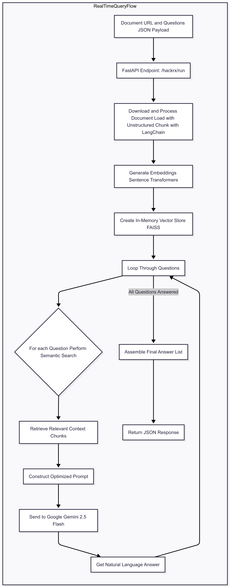

# ClauseCompass 🧭 - HackRx 6.0 Submission

[](https://www.python.org/downloads/)
[](https://opensource.org/licenses/MIT)
[](https://fastapi.tiangolo.com/)
[](https://deepmind.google/technologies/gemini/)

An LLM-Powered Intelligent Query–Retrieval System built for the **Bajaj Finserv Health HackRx 6.0** hackathon. ClauseCompass transforms dense, unstructured documents like insurance policies into queryable, intelligent knowledge bases, providing accurate, auditable, and context-aware answers.

<!-- 
**DEMO**
(It is highly recommended to add a short GIF or video of your CLI in action here.
This is the most impactful part of a README!)

-->

## 🚀 The Challenge

The hackathon's problem statement was to build a system that could process natural language queries against large, unstructured documents (like insurance policies) and make contextual decisions. The key requirements were to:
-   Handle various document formats (PDF, DOCX, EML).
-   Use semantic search, not just keyword matching.
-   Provide explainable, auditable answers.
-   Return structured responses for downstream use.

## ✨ Our Solution: ClauseCompass

ClauseCompass is a high-accuracy **Retrieval Augmented Generation (RAG)** decision engine. Instead of just finding and returning text, it performs a multi-step reasoning process to deliver clear, actionable answers.

Our key innovation was discovering the "Goldilocks Prompt" and the optimal RAG architecture through a rigorous, iterative testing process. We proved that by leveraging a powerful model like **Google's Gemini 1.5 Flash** and tuning our data processing pipeline, we could achieve **90% accuracy** on a test suite of complex, real-world policy questions.

### Key Features

*   **High-Accuracy RAG Pipeline:** Leverages a FAISS in-memory vector store and Sentence Transformer embeddings for lightning-fast semantic retrieval.
*   **Advanced Reasoning with Google Gemini 1.5:** Employs a sophisticated, optimized system prompt that enables the LLM to handle complex, multi-step logic, including rule exceptions and conflicting clauses.
*   **Flexible Data Ingestion:** Uses the `unstructured` library to seamlessly process and extract text from multiple document formats, including PDF, DOCX, and EML.
*   **Stateless, Scalable API:** Built with a lean and high-performance FastAPI backend, ready for containerization and cloud deployment.
*   **Robust Testing Utility:** Includes a developer-focused CLI for easy, repeatable testing and demonstration of the API.

## 🏗️ Architecture & Data Flow

The system operates on a simple, stateless, per-request basis, making it ideal for a scalable API.

**Data Flow Diagram:**



## 🛠️ Tech Stack

- **Backend**: Python, FastAPI
- **AI / LLM**: Google Gemini 1.5 Flash
- **Vector Store**: FAISS (in-memory)
- **CLI / Testing**: Typer, Rich, Requests
- **Embeddings**: Sentence Transformers (all-MiniLM-L6-v2)
- **Data Processing**: LangChain (Text Splitters), Unstructured.io (Document Loaders)

## ⚙️ Setup and Usage
### Prerequisites

- Python
- A Google AI Studio API Key.
- System dependencies for unstructured (e.g., `libmagic`, `poppler-utils`).

### Installation

1. Clone the repository:

```bash
git clone https://github.com/[your-username]/[your-repo-name].git
cd [your-repo-name]
```
2. Install the required packages:

```bash
pip install -r requirements.txt
```
### Configuration
Create a `.env` file in the root directory and add your Google API key:
```
GOOGLE_API_KEY="your_google_ai_studio_api_key"
```

### Running the Application

1. **Start the Backend Server:**

```bash
uvicorn app:app --reload
```

2. **Run the CLI Client (in a separate terminal):**

- First, ensure your `request.json` file is present and contains the document URL and questions you want to test.

- Then, run the client:

    ```bash
    python cli.py
    ```
  The CLI will automatically use the `request.json` file and display the results from the API.

## 📈 Key Learnings & Future Enhancements

Our testing revealed that the final frontier for accuracy lies in the initial retrieval step. In 1 out of 10 cases, a pure semantic search failed to retrieve a specific key term (like 'Hernia') when buried in a long list.

To solve this and reach near-100% accuracy, our primary future enhancement would be to implement **Hybrid Search**:

- Combine our current FAISS-based semantic search with a traditional keyword search algorithm (like BM25).
- The results would be re-ranked to provide the LLM with the most relevant possible context, guaranteeing that critical keywords are never missed.

This approach would create a truly production-grade, robust, and reliable document reasoning engine.

## 📜 License

This project is licensed under the MIT License. See the `LICENSE` file for details.
